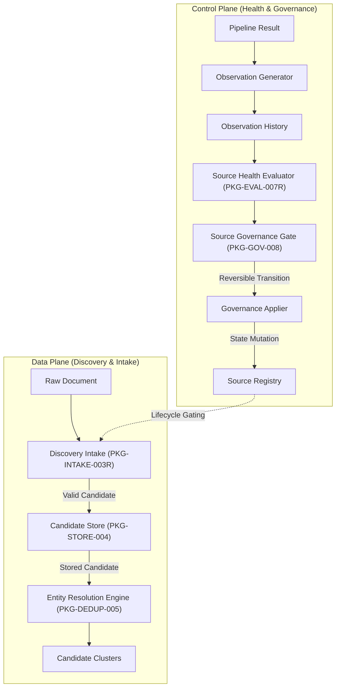

# DISCOVERY CORE ARCHITECTURE BLUEPRINT

## 1. Executive Summary & Proven State
- **Architecture Status**: `ARCHITECTURE_PROVEN=YES`
- **Contract Status**: `CONTRACT_PROVEN=YES`
- **In-Memory E2E Status**: `IN_MEMORY_E2E_PROVEN=YES`
- **Production Status**: `PRODUCTION_READY=NO`
- **Milestone Version**: `checkpoint/discovery-core-v1`

The Discovery Core subsystem orchestrates the intake, storage, entity resolution, health evaluation, and lifecycle governance of external startup data sources without compromising data integrity, provenance, or confidentiality.

---

## 2. Proven Boundaries vs Production Gaps

### A. Proven Boundaries (In-Memory & Contract-Verified)
1. **Source Registry Lifecycle Contracts (`PKG-001`)**: Strict deterministic state machine (`UNKNOWN`, `DISCOVERED`, `EVALUATED`, `APPROVED`, `ACTIVE`, `DEGRADED`, `LOW_PRIORITY`, `PAUSED`, `REJECTED`, `RETIRED`).
2. **Collector Boundary (`PKG-COL-001`)**: Authoritative normalization, HTTPS enforcement, and slug sanitization.
3. **Discovery Intake Validation (`PKG-INTAKE-003R`)**: Reversible confidentiality sanitization, zero provenance spoofing, and clock-independent pure validation.
4. **Candidate Storage Engine (`PKG-STORE-004`)**: Canonical domain deduplication, conflict rejection, and immutable append-only attribution trails.
5. **Entity Resolution Engine (`PKG-DEDUP-005`)**: Order-independent deterministic pair evaluation, multi-source clustering, and zero AI-hallucinated merge authority.
6. **Sequential Discovery Pipeline (`PKG-PIPELINE-006`)**: Fail-closed Intake -> Store -> Resolution transit.
7. **Source Health Evaluation (`PKG-EVAL-007R`)**: Strict observation windowing, sample sufficiency confidence, and orthogonal operational health vs intelligence contribution.
8. **Automated Governance Lifecycle Gate (`PKG-GOV-008`)**: Reversible operational transition gate, hysteresis and cooldown enforcement, stale decision rejection, and prohibition of auto-activation/rejection.
9. **End-to-End Orchestration (`PKG-DISC-E2E-009`)**: Full Data Plane and Control Plane decoupling with 100% test pass rate.

### B. Not Proven for Production (Known Production Gaps)
1. **PostgreSQL Discovery Persistence**: Currently backed by `InMemoryDiscoveryCandidateStore`.
2. **Observation Persistence**: Observations are currently memory-bound in runtime arrays.
3. **Governance Persistence & Locking**: Distributed concurrency and distributed state locks are not yet implemented.
4. **Worker Runtime & Background Schedulers**: No distributed queues (e.g. BullMQ, Redis, Temporal).
5. **Real Credential & Secrets Management**: Vault/KMS integration not wired to live collectors.
6. **Live Authenticated Collector Ingestion**: Real TrustMRR payload capture remains parked (`PKG-COL-002B`).
7. **Production Observability & Metrics**: Prometheus/OpenTelemetry metrics export not yet integrated.

---

## 3. Subsystem Architecture

---

## 4. TrustMRR Source Status
- **Evaluation Status**: `APPROVE_CONTROLLED_COLLECTION`
- **Collector Implementation**: `YES` (`src/collectors/trustmrr.mjs`)
- **Unauthenticated Fail-Closed**: `PROVEN` (Rejects mock/fallback data when unauthenticated)
- **Authenticated Real Data Payload**: `NOT_PROVEN`
- **Source Registry Status**: `APPROVED` (`SOURCE_ACTIVE=NO`)
- **Parked Track**: `PKG-COL-002B`
- **Activation Trigger**: Authorized TrustMRR API credentials provided in production environment.
