# CONTROLLED SINGLE-INSTANCE PILOT READINESS GATE (PKG-PILOT-GATE-021R)

## 1. Executive Summary & Authoritative Verdict

- **Target Operational Profile**: `CONTROLLED_SINGLE_INSTANCE` (1 source, 1 collector, bounded cadence, human operator).
- **Audit Date**: 2026-08-30 (Remediated: 021R)
- **Auditor**: Lead Systems Architect & Verification Authority (Antigravity)
- **Repository Commit**: `8c928a8b19f9d396da013bd513515c962943c0c7`

### PILOT VERDICT
```text
================================================================================
PILOT_GO = NO (BLOCKED ON EXACTLY 2 EXTERNAL PREREQUISITE TRACKS)
MANDATORY GATES TOTAL: 23 | PASS: 10 | FAIL: 13
================================================================================
```

---

## 2. Mandatory Gate Audit Matrix (GATE-001 through GATE-024)

| Gate ID | Gate Description | Evidence Tier | Status | Exact Blocker / Evidence Classification |
| :--- | :--- | :--- | :--- | :--- |
| **GATE-001** | Full Repository Cleanliness & Integrity | `TEST`, `STATIC_ANALYSIS` | **PASS** | 180/180 tests pass across 30 suites; lint, typecheck, build, git diff clean. |
| **GATE-002** | Complete Pipeline Composition Architecture | `REFERENCE_RUNTIME`, `TEST` | **PASS** | `DiscoveryRuntimeHost` unites Scheduler, Worker, Secrets, Collector, Pipeline, Governance. |
| **GATE-003** | Runtime Lifecycle & Shutdown Hardening | `REFERENCE_RUNTIME`, `TEST` | **PASS** | `HardenedRuntimeController` with CREATED->READY->STOPPED lifecycle, overlap rejection, graceful stop. |
| **GATE-004** | Live PostgreSQL Startup & Connection | `STATIC_SCHEMA` | **FAIL** | Blocked on live PostgreSQL connectivity (`PKG-DBRUN-012B`). |
| **GATE-005** | Database-Level Idempotency Proof | `STATIC_SCHEMA`, `TEST` | **FAIL** | Unique indexes defined; live DB replay blocked (`PKG-DBRUN-012B`). |
| **GATE-006** | Atomic Operational Transactions | `STATIC_SCHEMA`, `TEST` | **FAIL** | Multi-row durable transaction atomicity blocked on PostgreSQL (`PKG-DBRUN-012B`). |
| **GATE-007** | Source State & Lifecycle Durability | `REFERENCE_RUNTIME`, `TEST` | **FAIL** | Schema/contract proven in reference runtime; durable PostgreSQL runtime proof missing (`PKG-DBRUN-012B`). |
| **GATE-008** | Automatic Governance Safety | `TEST`, `MANUAL_POLICY` | **PASS** | `governanceApplicationMode: DISABLED_FOR_PILOT` strictly preserved. |
| **GATE-009** | Scheduler Slot Durability Across Restarts | `REFERENCE_RUNTIME`, `TEST` | **FAIL** | Slot uniqueness proven in reference; durable DB restart proof blocked (`PKG-DBRUN-012B`). |
| **GATE-010** | Worker Task & Attempt Ledger Durability | `REFERENCE_RUNTIME`, `TEST` | **FAIL** | Task/attempt ledger proven in reference; durable round-trip blocked (`PKG-DBRUN-012B`). |
| **GATE-011** | Authorized Live Source Access | `MANUAL_POLICY` | **FAIL** | No authorized live source credentials available (`PKG-COL-002B`). |
| **GATE-012** | TrustMRR / Feed Contract (Non-universal) | `TEST`, `STATIC_SCHEMA` | **FAIL** | Non-universal gate; collector contract proven; live execution blocked (`PKG-COL-002B`). |
| **GATE-013** | Secret Redaction & Isolation Boundary | `SECURITY_REVIEW`, `TEST` | **PASS** | Atomic `SecretResolver` + scoped redaction; zero task/log leakage (`SEC-I001` - `SEC-I020`). |
| **GATE-014** | Live Secret Configuration Readiness | `MANUAL_POLICY` | **FAIL** | Real credentials unavailable; names-only manifest satisfies config doc, not live secret readiness (`PKG-COL-002B`). |
| **GATE-015** | Confidentiality Durable Round-Trip | `TEST`, `REFERENCE_RUNTIME` | **FAIL** | Reference confidentiality proven; live PostgreSQL durable round-trip proof missing (`PKG-DBRUN-012B`). |
| **GATE-016** | Provenance & Source Claim on Live Route | `TEST`, `REFERENCE_RUNTIME` | **FAIL** | Reference contract proven; verification on real live source + durable route missing (`PKG-DBRUN-012B` & `PKG-COL-002B`). |
| **GATE-017** | Observability & Operational Log Visibility | `TEST`, `REFERENCE_RUNTIME` | **FAIL_PENDING_RUNTIME_PROOF** | In-memory telemetry proven; actual operational structured log output pending live execution proof. |
| **GATE-018** | Process Crash Recovery & Restart | `REFERENCE_RUNTIME` | **FAIL** | Conceptual reconstruction defined; durable DB restart proof blocked (`PKG-DBRUN-012B`). |
| **GATE-019** | Network & Transport Safety on Live Path | `TEST` | **FAIL** | Reference network policy proven; authorized live network path proof missing (`PKG-COL-002B`). |
| **GATE-020** | Lifecycle Safety Invariants | `TEST`, `REFERENCE_RUNTIME` | **PASS** | Zero auto-activation; paused sources strictly blocked from dispatch. |
| **GATE-021** | Pilot Configuration Manifest | `MANUAL_POLICY` | **PASS** | Typed environment manifest with zero hardcoded credentials. |
| **GATE-022** | Operator Runbook | `MANUAL_POLICY` | **PASS** | Standard step-by-step operating procedures documented in `docs/ai/PILOT_RUNBOOK.md`. |
| **GATE-023** | Controlled Stop & Safe Teardown Plan | `MANUAL_POLICY`, `TEST` | **PASS** | Non-destructive shutdown preserves all collected records and audit logs. |
| **GATE-024** | Evidence Integrity Manifest | `STATIC_ANALYSIS`, `TEST` | **PASS** | All claims strictly grounded in test, schema, security review, or explicit policy. |

---

## 3. Consolidation of 13 Failed Gates into 2 External Prerequisites

```mermaid
graph TD
  P0_1["BLOCKER A: Disposable PostgreSQL Runtime (PKG-DBRUN-012B)"]
  P0_3["BLOCKER B: Authorized Live Source Credential (PKG-COL-002B)"]

  P0_1 --> G04["GATE-004 (Live DB Connection)"]
  P0_1 --> G05["GATE-005 (DB Idempotency)"]
  P0_1 --> G06["GATE-006 (Transaction Atomicity)"]
  P0_1 --> G07["GATE-007 (Source State Durability)"]
  P0_1 --> G09["GATE-009 (Slot Durability)"]
  P0_1 --> G10["GATE-010 (Task Durability)"]
  P0_1 --> G15["GATE-015 (Durable Confidentiality)"]
  P0_1 --> G18["GATE-018 (DB Crash Recovery)"]

  P0_3 --> G11["GATE-011 (Live Source Access)"]
  P0_3 --> G14["GATE-014 (Live Secret Config)"]
  P0_3 --> G19["GATE-019 (Live Network Path)"]

  P0_1 & P0_3 --> G16["GATE-016 (Live Route Source Claim)"]
  P0_1 & P0_3 --> G17["GATE-017 (Operational Log Visibility)"]
```



### Next Actionable Engineering Steps
1. **Track `PKG-DBRUN-012B`**: Execute migrations and test suite against a disposable PostgreSQL instance once available.
2. **Track `PKG-COL-002B`**: Execute live authenticated fetch once authorized credentials/access become available.
3. **Pilot Gate Re-evaluation**: Re-run gate verification with resulting live proofs to achieve `PILOT_GO=YES`.
