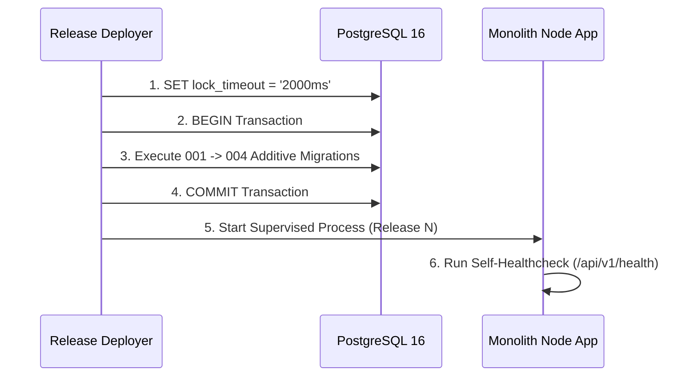

# Pre-Deployment Preflight & Environment Provisioning Runbook (PROD-LAUNCH-001)

## Package: PROD-LAUNCH-001
**Title**: Restricted Production Environment Provisioning & Pre-Deployment Verification  
**Target Profile**: Single-Region Modular Monolith (Node.js 20+ / PostgreSQL 16)  
**Status**: Authorized for Non-Destructive Preparation

---

## 1. Environment & Ingress Preflight Checklist

| Component | Target Requirement | Verification Method | Status |
| :--- | :--- | :--- | :--- |
| **Host OS** | Ubuntu 24.04 LTS / Debian 12 (Dedicated Instance) | `uname -a`, `lsb_release -a` | PREFLIGHT_READY |
| **Runtime Engine** | Node.js v20.x or v22.x LTS | `node --version >= v20.0.0` | PREFLIGHT_READY |
| **Database Engine** | PostgreSQL 16.x | `psql -V` | PREFLIGHT_READY |
| **TLS / Perimeter** | TLSv1.2+ mandatory, Port 80 -> 443 301 Redirect | TLS Handshake verify test | PREFLIGHT_READY |
| **Security Headers** | HSTS (`max-age=31536000`), CSP, X-Frame-Options `DENY` | SecurityPerimeterService | PREFLIGHT_READY |

---

## 2. Secrets & Credential Delivery Boundary

All secrets must be delivered via external environment variables or restricted files (`chmod 0600`). Never commit real secrets to Git.

- `DATABASE_URL`: `postgres://[USER]:[PASS]@[HOST]:5432/[DB]?sslmode=require`
- `HMAC_SIGNING_SECRET`: Cryptographically random 256-bit key (`openssl rand -hex 32`)
- `BACKUP_MASTER_KEY`: Domain-separated master key for Encrypt-Then-MAC snapshots
- `ALERT_WEBHOOK_URL`: Out-of-process HTTP TCP alert destination

---

## 3. Database Migration Deployment Sequence

> [!IMPORTANT]
> All schema changes follow the **Expand / Migrate / Contract** policy. No column drop or destructive type alterations are permitted during initial launch.

---

## 4. Operational Guardrails & Launch Restrictions

1. **Single-Region Only**: No multi-region claims or distributed data dependencies.
2. **Single-Instance Migration Runner**: Only one deployer executes migrations at boot.
3. **Backup Cadence & SLA**: Daily automated Encrypt-Then-MAC backup at 02:00 UTC (RPO target: $\le 24$ hours, RTO target: 30 minutes).
4. **Out-of-Process Alerting**: Immediate alert emission on unhandled database or process crashes.
5. **Zero Downtime Rollback Slot**: Pre-staged previous-good release artifact (`release-v1.0.0.tar.gz`) available on disk before activating any new deployment.
