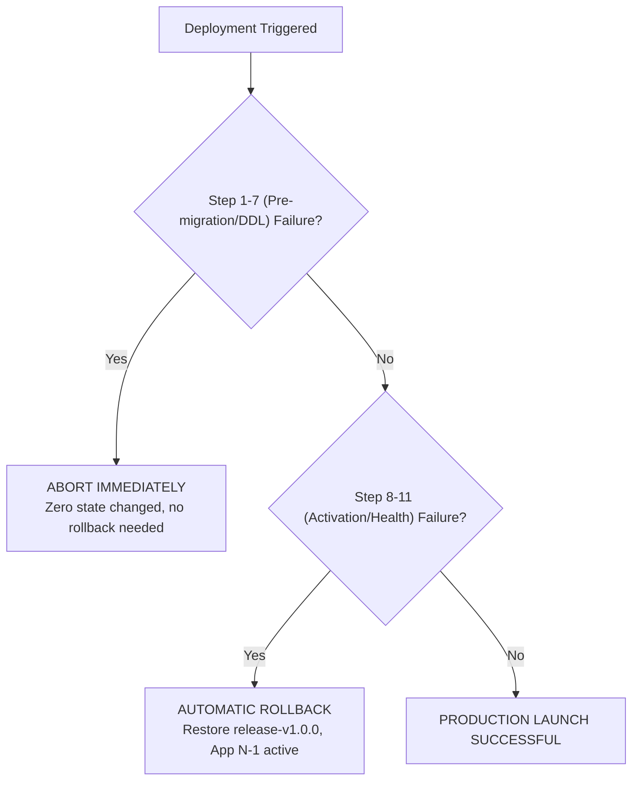

# Production Change & Rollback Plan (PROD-LAUNCH-002)

## Package: PROD-LAUNCH-002
**Target Profile**: Single-Region Restricted Modular Monolith  
**Scope**: 14-Step Deterministic Deployment Sequence with Abort Criteria

---

## 1. Step-by-Step Production Change Sequence

| Step | Phase | Action / Command | Owner | Expected Result | Failure Action |
| :--- | :--- | :--- | :--- | :--- | :--- |
| **1** | PRE_DEPLOY_CHECKS | `node -e "import('./src/security/host-preflight.mjs').then(m=>console.log(m.runHostPreflight()))"` | SRE / Antigravity | All host checks `PASS` | **ABORT** |
| **2** | BACKUP_CONFIRMATION | `bash scripts/automated_backup.sh` | SRE / Database Admin | Encrypt-Then-MAC snapshot created and tag verified | **ABORT** |
| **3** | RELEASE_UPLOAD | Transfer `release-v1.0.0.tar.gz` to `/var/app/releases` | Release Engineer | File stored with `0600` permissions | **ABORT** |
| **4** | CHECKSUM_VERIFY | `sha256sum -c release-v1.0.0.tar.gz.sha256` | Release Engineer | Checksum matches manifest exactly | **ABORT** |
| **5** | SECRET_INSTALLATION | Inject `DATABASE_URL`, `HMAC_SECRET`, `BACKUP_KEY` via env/0600 file | SRE | Secrets loaded into supervisor runtime; zero log leakage | **ABORT** |
| **6** | DB_CONNECTIVITY | `psql $DATABASE_URL -c "SELECT 1;"` with TLS | Database Admin | SSL connection confirmed | **ABORT** |
| **7** | MIGRATION_EXECUTION | `node -e "import('./src/storage/migration-runner.mjs').then(m=>m.run())"` | Migration Runner | 001->004 additive transactional migrations applied | **ABORT** (Atomic rollback) |
| **8** | APP_ACTIVATION | `node src/server.mjs` supervised by `OSProcessSupervisor` | SRE | Parent spawns child; PID recorded | **ROLLBACK** |
| **9** | HEALTHCHECK | `curl -f https://127.0.0.1:8443/api/v1/health` | Automated Monitor | HTTP 200 `STATUS_HEALTHY` | **ROLLBACK** |
| **10** | ALERT_VERIFICATION | Trigger heartbeat ping to out-of-process TCP sink | SRE | Event acknowledged by receiver | **ABORT_INITIAL_LAUNCH** |
| **11** | POST_DEPLOY_SMOKE | Run read-model & authentication smoke queries | QA / Antigravity | 100% assertions green | **ROLLBACK** |
| **12** | PREVIOUS_GOOD_STAGING | Stage `release-v1.0.0.tar.gz` in rollback slot | Release Engineer | Rollback slot active and validated | **LOG_WARNING** |
| **13** | OPERATIONAL_MONITOR | Monitor metrics & error rates for 30 minutes | Operations Lead | Zero 5xx error spikes | **ROLLBACK** |
| **14** | SIGN_OFF | Issue official deployment completion report | Commander / Manager | Deployment formally closed | N/A |

---

## 2. Deterministic Abort & Rollback Criteria

### Mandatory Abort Triggers:
1. `MIGRATION_FAILURE` $\rightarrow$ **ABORT** (Transactional rollback protects schema).
2. `HEALTHCHECK_FAILURE` $\rightarrow$ **ROLLBACK** to previous good release artifact.
3. `AUTH_OR_RBAC_FAILURE` $\rightarrow$ **ROLLBACK** immediately.
4. `BACKUP_NOT_HEALTHY` $\rightarrow$ **ABORT** prior to running migrations.
5. `RELEASE_CHECKSUM_FAILURE` $\rightarrow$ **ABORT** immediately.
