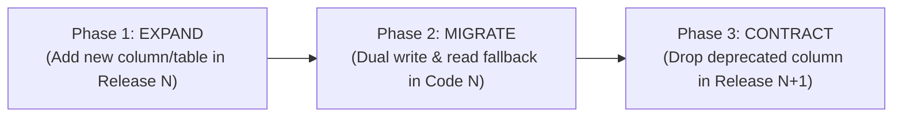

# Database Schema Evolution Policy: Expand/Contract Architecture (PROD-READINESS-002R)

## 1. Core Principle: Zero-Downtime Non-Destructive Migrations
All database schema changes in the Global Opportunity Intelligence Platform MUST follow the **Expand / Migrate / Contract** design pattern. No forward migration may ever drop a column, rename a column, or alter a type destructively in the same release as application changes.

---

## 2. The Three-Phase Evolution Lifecycle

### Phase 1: EXPAND (Release N)
- Add new tables or nullable columns (`ADD COLUMN name VARCHAR(128)`).
- Never add `NOT NULL` columns without a default value.
- The existing application version `N-1` continues to function with 100% compatibility.

### Phase 2: MIGRATE (Application Version N)
- Application writes to both old and new schema structures if applicable.
- Backfill scripts populate historical records in small batches.
- If application version `N` crashes or fails healthcheck, rolling back to `N-1` is 100% safe because old schema structures remain intact.

### Phase 3: CONTRACT (Release N+1)
- Once the rollback window for Release `N` closes (minimum 7 days in production), a separate migration drops old unused columns or constraints.
- Destructive changes are strictly isolated to contract-only releases.

---

## 3. Operational Guarantees
1. **Lock-Safe DDL Execution**: Every migration script MUST execute with `SET lock_timeout = '2000ms'` to prevent blocking application queries during table lock acquisition.
2. **Transactional Migration Blocks**: All migration steps run wrapped in `BEGIN ... COMMIT` blocks to guarantee automatic rollback on syntax or constraint errors.
3. **No Fabricated Down Migrations**: Down migrations are not used in production. Recovery from bad releases is achieved by rolling back the application code (which remains compatible with the expanded schema).
